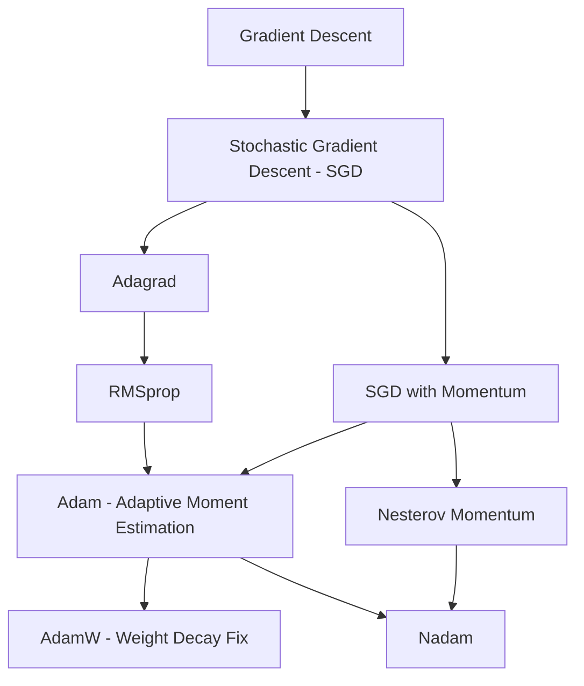
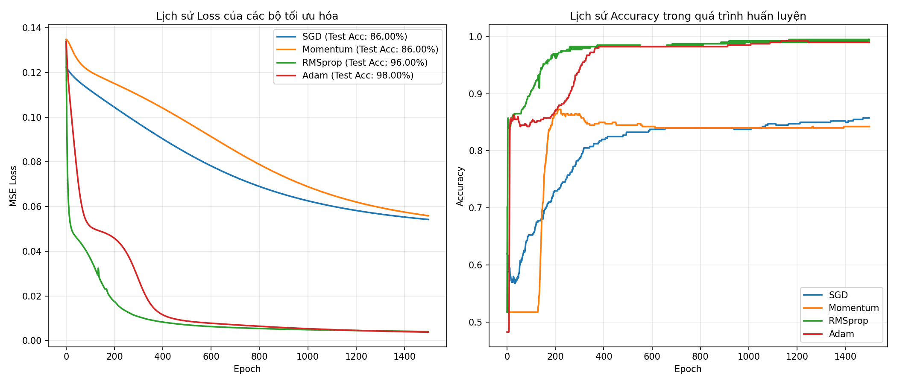

# Các phương pháp tối ưu hóa (Optimizers) trong Deep Learning: Từ SGD đến Adam

Trong huấn luyện mạng nơ-ron (Deep Learning), mục tiêu cốt lõi là tìm tập hợp các tham số $\theta$ (gồm weights $W$ và biases $b$) sao cho hàm mất mát (Loss function) $L(\theta)$ đạt giá trị nhỏ nhất. 

Quá trình này được thực hiện bởi các **thuật toán tối ưu hóa (Optimizers)**. Dưới đây là hành trình tiến hóa của các phương pháp tối ưu phổ biến nhất, tập trung vào thuật toán **Adam**.

---

👉 Tra cứu nhanh các ký hiệu toán học tại: [Cheat Sheet: Ký hiệu & Ý nghĩa toán học trong Tối ưu hóa](cheatsheet.md)

---

## 1. Bản đồ tiến hóa của các Optimizers

Các thuật toán tối ưu hóa trong Deep Learning phát triển qua hai nhánh cải tiến chính:
1. **Nhánh Động lượng (Momentum)**: Giúp tăng tốc độ học và vượt qua các điểm cực tiểu cục bộ (local minima) hoặc điểm yên ngựa (saddle points) bằng cách giữ lại quán tính từ các bước đi trước.
2. **Nhánh Tốc độ học thích ứng (Adaptive Learning Rate)**: Điều chỉnh tốc độ học riêng biệt cho từng tham số dựa trên tần suất cập nhật của chúng.

*Hình 1: Minh họa nổi tiếng của Alec Radford cho thấy tốc độ vượt qua điểm yên ngựa (saddle point) của các thuật toán tối ưu.*

---

## 2. Chi tiết các thuật toán tối ưu hóa

Ký hiệu sử dụng:
* $\theta_t$: Tham số (Weights/Biases) tại bước $t$.
* $g_t = \nabla_\theta L(\theta_t)$: Gradient của hàm Loss đối với $\theta$ tại bước $t$.
* $\eta$ (hoặc $\alpha$): Tốc độ học (Learning rate).
* $\epsilon$: Một số cực nhỏ (thường là $10^{-8}$) tránh lỗi chia cho 0.

### 2.1 Stochastic Gradient Descent (SGD) với Động lượng (Momentum)

#### **Hạn chế của SGD thông thường:**
SGD cập nhật tham số trực tiếp bằng cách đi ngược hướng gradient: $\theta_{t+1} = \theta_t - \eta g_t$. Nếu bề mặt hàm Loss có dạng "thung lũng hẹp" (high curvature), SGD sẽ dao động liên tục qua lại hai bên sườn dốc thay vì đi nhanh dọc theo đáy thung lũng về phía cực tiểu.

*Hình 2: Đường đi của GD mượt mà nhưng tính toán cồng kềnh trên toàn bộ tập dữ liệu, trong khi SGD zig-zag nhưng cập nhật liên tục và phù hợp hơn với online learning.*

#### **Cải tiến từ Momentum:**
Momentum mô phỏng một viên bi lăn từ trên dốc. Nó tích lũy động lượng từ các bước trước đó để đẩy viên bi lăn nhanh hơn ở các hướng có gradient nhất quán và triệt tiêu các dao động ở hướng ngược nhau.

*Hình 3: Lực quán tính giúp viên bi vượt qua đỉnh dốc E của cực tiểu cục bộ D để lăn tới cực tiểu toàn cục C.*

#### **So sánh trực quan khi có và không có Momentum:**

|                       SGD không Momentum (Kẹt tại cực tiểu cục bộ)                        |                  SGD có Momentum (Vượt qua để đến cực tiểu toàn cục)                   |     |
| :---------------------------------------------------------------------------------------: | :------------------------------------------------------------------------------------: | --- |
|  |  |     |
|                           *Mô phỏng tối ưu hóa không Momentum*                            |                           *Mô phỏng tối ưu hóa có Momentum*                            |     |
|                                                                                           |                                                                                        |     |

#### **Công thức:**
1. Cập nhật vận tốc (động lượng):
   $$v_t = \beta v_{t-1} + (1 - \beta) g_t$$
   *(Trong đó $\beta \in [0, 1)$ là hệ số ma sát/động lượng, thường chọn $0.9$)*
2. Cập nhật tham số:
   $$\theta_{t+1} = \theta_t - \eta v_t$$

---

### 2.2 RMSprop (Root Mean Squared Propagation)

#### **Hạn chế của AdaGrad:**
AdaGrad điều chỉnh tốc độ học cho từng tham số bằng cách chia $\eta$ cho căn bậc hai của tổng bình phương tất cả các gradient trong quá khứ. Nhược điểm lớn của AdaGrad là tổng bình phương này tích lũy tăng dần theo thời gian, khiến tốc độ học giảm quá nhanh và mô hình dừng học trước khi hội tụ.

#### **Cải tiến từ RMSprop:**
RMSprop (phát triển bởi Geoffrey Hinton) khắc phục nhược điểm của AdaGrad bằng cách thay tổng tích lũy bằng **trung bình trượt lũy thừa (exponentially decaying average)** của bình phương gradient. Nó chỉ tập trung vào các gradient gần đây nhất.

#### **Công thức:**
1. Ước lượng bình phương gradient gần đây (Moment bậc 2):
   $$s_t = \beta_2 s_{t-1} + (1 - \beta_2) g_t^2$$
   *(Trong đó $\beta_2$ thường chọn $0.9$ hoặc $0.99$)*
2. Cập nhật tham số:
   $$\theta_{t+1} = \theta_t - \frac{\eta}{\sqrt{s_t} + \epsilon} g_t$$

* **Ý nghĩa:** Nếu một tham số có gradient rất lớn và dao động liên tục (ví dụ hướng dọc theo sườn thung lũng), $s_t$ lớn $\rightarrow$ tốc độ học thực tế $\frac{\eta}{\sqrt{s_t} + \epsilon}$ giảm đi, giúp giảm dao động. Ngược lại, nếu gradient nhỏ (hướng dọc theo đáy thung lũng), $s_t$ nhỏ $\rightarrow$ tốc độ học thực tế lớn hơn, giúp di chuyển nhanh hơn.

---

### 2.3 Thuật toán Adam (Adaptive Moment Estimation)

**Adam** là thuật toán tối ưu hóa "quốc dân", kết hợp các ưu điểm mạnh nhất của cả **Momentum** và **RMSprop**:
* **Từ Momentum**: Lưu trữ trung bình trượt lũy thừa của các gradient trước đó (gọi là **Moment bậc 1** - hướng đi).
* **Từ RMSprop**: Lưu trữ trung bình trượt lũy thừa của bình phương gradient trước đó (gọi là **Moment bậc 2** - độ lớn dao động để điều chỉnh learning rate thích ứng).

*Hình 4: Nếu Momentum như một quả cầu lăn tự do dễ bị trượt quá đích, thì Adam hoạt động như một quả cầu rất nặng có ma sát giúp dễ hội tụ và dừng lại ở cực tiểu toàn cục.*

#### **Công thức toán chi tiết của Adam:**

##### **Bước 1: Tính toán Gradient**
$$g_t = \nabla_\theta L(\theta_t)$$

##### **Bước 2: Cập nhật trung bình trượt lũy thừa của gradient (Moment bậc 1 - Động lượng)**
$$m_t = \beta_1 m_{t-1} + (1 - \beta_1) g_t$$
*(Đại diện cho hướng đi mong muốn. Siêu tham số khuyến nghị $\beta_1 = 0.9$)*

##### **Bước 3: Cập nhật trung bình trượt lũy thừa của bình phương gradient (Moment bậc 2 - Thích ứng lr)**
$$v_t = \beta_2 v_{t-1} + (1 - \beta_2) g_t^2$$
*(Đại diện cho độ biến động của gradient. Siêu tham số khuyến nghị $\beta_2 = 0.999$)*

##### **Bước 4: Hiệu chỉnh độ lệch (Bias Correction)**
Vì $m_0$ và $v_0$ được khởi tạo bằng $0$, trong những bước đầu tiên (khi $t$ nhỏ), $m_t$ và $v_t$ sẽ bị kéo lệch rất gần về $0$ (do $\beta_1$ và $\beta_2$ gần bằng $1$). Để khắc phục sự mất cân bằng này ở giai đoạn đầu, ta tiến hành hiệu chỉnh:
$$\hat{m}_t = \frac{m_t}{1 - \beta_1^t}$$
$$\hat{v}_t = \frac{v_t}{1 - \beta_2^t}$$
*(Khi $t \to \infty$, $\beta^t \to 0$ và $\hat{m}_t \to m_t$, nên việc hiệu chỉnh này chỉ có tác dụng quan trọng ở các epoch đầu tiên)*

##### **Bước 5: Cập nhật tham số**
$$\theta_{t+1} = \theta_t - \frac{\eta}{\sqrt{\hat{v}_t} + \epsilon} \hat{m}_t$$

---

## 3. Vì sao Adam lại vượt trội?

1. **Khả năng tự thích ứng**: Không cần chỉnh tay learning rate phức tạp, thuật toán tự động giảm tốc độ cập nhật cho các tham số dao động mạnh và tăng tốc cho các tham số ổn định.
2. **Kháng nhiễu tốt**: Thích hợp cho các bài toán có tập dữ liệu lớn và nhiễu (noisy gradients), hoặc các mạng nơ-ron rất sâu.
3. **Hiệu năng cao**: Chi phí bộ nhớ và tính toán thấp ($O(N)$ bộ nhớ, chỉ cần lưu thêm các ma trận $m$ và $v$).
4. **Vượt qua các thử thách địa hình**: Hoạt động cực kỳ hiệu quả để thoát khỏi các vùng yên ngựa (saddle points) nơi mà gradient tiến gần bằng 0 nhưng không phải cực tiểu.

---

## 4. Cải tiến của Adam: AdamW (Weight Decay Fix)

Mặc dù Adam rất mạnh mẽ, các nghiên cứu thực nghiệm nhận thấy trong nhiều bài toán Computer Vision, **SGD với Momentum** có khả năng tổng quát hóa (generalization) trên tập Test tốt hơn Adam. Lý do chính nằm ở cách Adam xử lý kỹ thuật điều chuẩn **L2 Regularization (Weight Decay)**.

* Trong **Adam truyền thống**, việc cộng thêm số hạng L2 regularization ($L_{new} = L_{old} + \frac{\lambda}{2}\theta^2$) làm thay đổi trực tiếp gradient $g_t$, dẫn đến số hạng weight decay cũng bị tỷ lệ hóa qua $\sqrt{v_t}$. Điều này làm sai lệch tác dụng thực tế của Weight Decay.
* **AdamW** giải quyết lỗi này bằng cách thực hiện Weight Decay **trực tiếp** lên trọng số sau khi cập nhật gradient thích ứng:
  $$\theta_{t+1} = \theta_t - \eta \left( \frac{\hat{m}_t}{\sqrt{\hat{v}_t} + \epsilon} + \lambda \theta_t \right)$$
  *(Trong đó $\lambda$ là hệ số Weight Decay)*

> [!IMPORTANT]
> Hầu hết các thư viện Deep Learning hiện đại (PyTorch, TensorFlow, Hugging Face) đều khuyến nghị sử dụng **AdamW** thay vì **Adam** tiêu chuẩn khi huấn luyện các mô hình lớn như Transformers (LLMs, ViT, v.v.).

---

## 5. Bảng so sánh các thuật toán tối ưu hóa

| Optimizer | Ưu điểm | Nhược điểm | Trường hợp khuyên dùng |
| :--- | :--- | :--- | :--- |
| **SGD** | Đơn giản, tính toán rất nhanh. Dễ hội tụ đến cực trị phẳng giúp tổng quát hóa tốt hơn. | Hội tụ chậm, dễ bị kẹt tại điểm yên ngựa hoặc dao động sườn dốc. | Các bài toán cổ điển hoặc khi cần tinh chỉnh (fine-tune) sau khi đã dùng Adam. |
| **Momentum** | Vượt qua điểm yên ngựa tốt, giảm dao động, hội tụ nhanh hơn SGD. | Cần tinh chỉnh siêu tham số $\beta$ và tốc độ học $\eta$ khá cẩn thận. | Phổ biến trong CNNs cổ điển (ResNet, v.v.). |
| **RMSprop** | Học thích ứng, giải quyết tốt bài toán gradient triệt tiêu/bùng nổ. | Vẫn cần tinh chỉnh tốc độ học cơ bản $\eta$. | Thích hợp cho mạng nơ-ron hồi quy (RNNs, LSTMs). |
| **Adam** | Hội tụ cực nhanh, tự động hóa lr, kết hợp hướng đi (Momentum) và độ lớn (RMSprop). | Yêu cầu thêm bộ nhớ gấp 2 lần kích thước tham số. Có thể bị overfitting nếu không điều chuẩn tốt. | Là optimizer mặc định tốt nhất cho hầu hết mọi kiến trúc mạng. |
| **AdamW** | Sửa lỗi Weight Decay của Adam, cải thiện khả năng tổng quát hóa đáng kể trên tập test. | Yêu cầu bộ nhớ giống Adam. | Huấn luyện **Transformers, LLMs, Bert, GPT** và các mạng học sâu hiện đại. |

---

## 6. Minh họa trực quan & Kết quả so sánh NumPy từ Scratch

Để có cái nhìn khách quan, chúng tôi đã xây dựng một mạng nơ-ron dạng MLP Classifier (kiến trúc `[2, 10, 5, 1]`) từ số không bằng NumPy, hỗ trợ tùy biến 4 bộ tối ưu khác nhau và huấn luyện trên tập dữ liệu phi tuyến **Half Moons** trong `1500` epochs.

* File cài đặt NumPy: [optimizers_comparison.py](file:///e:/DoCode/Master_Subject2026_TDTU/DeepLearning/gradient_descent/optimizers_comparison.py)

Dưới đây là đồ thị so sánh lịch sử Loss và độ chính xác (Accuracy) được tạo ra thực tế sau khi chạy mã nguồn trên:

*Hình 5: Lịch sử hội tụ của SGD, Momentum, RMSprop và Adam trên cùng bài toán classification. Có thể thấy rõ **Adam** và **RMSprop** hội tụ vượt trội với độ chính xác cao nhất (98% và 96%) và đường cong Loss giảm dốc cực nhanh.*