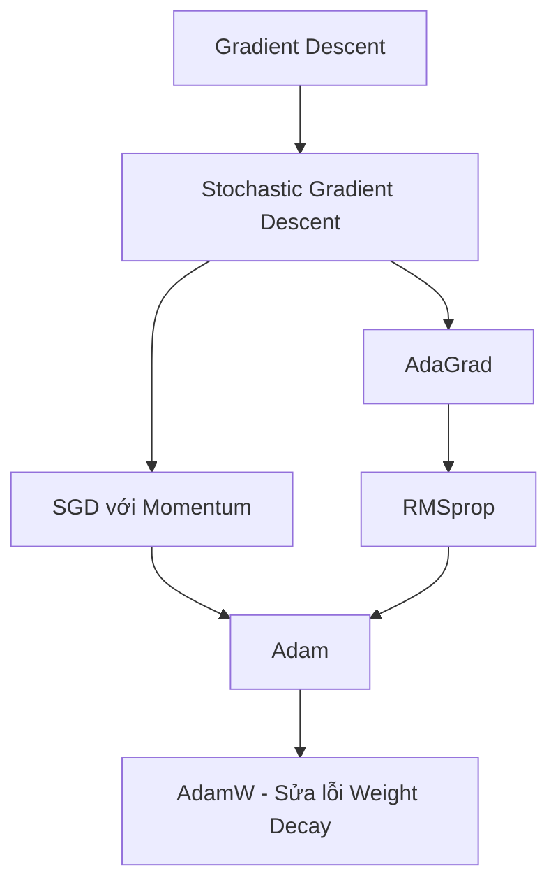

# CÁC PHƯƠNG PHÁP TỐI ƯU HÓA TRONG DEEP LEARNING
## Hành trình từ thuật toán cơ bản SGD đến cỗ máy "quốc dân" AdamW
### Mục tiêu: Tìm $\theta$ để $L(\theta)$ đạt giá trị cực tiểu toàn cục.

---

# 1. BẢN CHẤT CỦA GRADIENT & BACKPROPAGATION

* **Gradient ($\nabla_{\theta} L$)**: Là vector đạo hàm riêng chỉ ra hướng dốc đứng nhất của hàm mất mát.
* **Backpropagation**: Là giải thuật máy tính dựa trên **Chain Rule** và **Dynamic Programming** để tính Gradient hiệu quả nhất.

```
+------------------------------------------------------------------------------------+
|  Khái niệm     | Bản chất                                  | Câu hỏi trả lời       |
|----------------|-------------------------------------------|-----------------------|
| Gradient       | Đại lượng toán học (Vector đạo hàm).      | Cần thay đổi bao nhiêu|
|                |                                           | để giảm sai số?       |
|----------------|-------------------------------------------|-----------------------|
| Backprop       | Giải thuật máy tính (Truyền ngược sai số).| Tính đạo hàm thế nào  |
|                |                                           | nhanh & tiết kiệm nhất|
+------------------------------------------------------------------------------------+
```

---

# 2. TOÁN HỌC BACKPROPAGATION: SAI SỐ TẦNG ẨN ($\delta^l$)

Đạo hàm sai số được lan truyền ngược từng lớp qua các bước suy luận sau:

1. **Định nghĩa sai số tại lớp $l$**:
   $$\delta^l = \frac{\partial L}{\partial z^l}$$
2. **Tách đạo hàm qua hàm kích hoạt $a^l = g^l(z^l)$**:
   $$\delta^l = \frac{\partial L}{\partial a^l} \odot g'(z^l)$$
3. **Tính $\frac{\partial L}{\partial a^l}$ qua lớp kế tiếp $l+1$**:
   $$\frac{\partial L}{\partial a^l} = (W^{l+1})^T \delta^{l+1}$$
4. **Công thức lan truyền ngược sai số tổng quát**:
   $$\delta^l = (W^{l+1})^T \delta^{l+1} \odot g'(z^l)$$

---

# 3. CHU TRÌNH HUỐN LUYỆN KHÉP KÍN

Mỗi vòng lặp huấn luyện là một hệ thống khép kín tương tác liên tục:

```
          ┌───────────────> Dữ liệu & Mô hình ───────────────┐
          │                                                  │
    Cập nhật Trọng số                                   Hàm mất mát
  (W = [wij], b = [bi])                               (Loss function L(θ))
          ▲                                                  │
          │                                                  ▼
          └─────────────────── Optimizer ◄───────────────────┘
                       (Tính hướng đi & lực đẩy)
```

> **Optimizer** không tạo ra kiến trúc mạng, nhưng nó quyết định tốc độ và khả năng sống sót của mạng trên hành trình tìm kiếm điểm hoàn hảo.

---

# 4. BẢN ĐỒ TIẾN HÓA CỦA CÁC OPTIMIZERS

Các thuật toán tối ưu phát triển qua hai nhánh cải tiến bổ trợ nhau:

* **Nhánh Động lượng (Momentum)**: Giữ lại quán tính, giúp vượt qua cực tiểu cục bộ và điểm yên ngựa.
* **Nhánh Thích ứng (Adaptive)**: Điều chỉnh tốc độ học riêng biệt cho từng tham số dựa trên tần suất cập nhật.



---

# 5. GỐC RỄ & ĐIỂM MÙ: STOCHASTIC GRADIENT DESCENT (SGD)

* **Công thức cập nhật trực tiếp**:
  $$\theta_{t+1} = \theta_t - \eta g_t$$

* **Hạn chế**:
  * Dễ mất phương hướng ở địa hình thung lũng hẹp (high curvature).
  * Dao động zic-zac mạnh: Quá nhiều năng lượng lãng phí theo chiều ngang, quá chậm chạp tiến về đáy theo chiều dọc.
  * Phù hợp cho online learning nhưng kém hiệu quả trên các địa hình loss phức tạp.

---

# 6. NHÁNH 1: CÚ HÍCH TỪ QUÁN TÍNH (MOMENTUM)

* **Thuyết minh kỹ thuật**: Tích lũy động lượng từ bước trước. Tăng tốc ở hướng đi nhất quán và triệt tiêu hướng dao động ngược dấu.
* **Hệ thống công thức**:
  $$v_t = \beta v_{t-1} + (1 - \beta) g_t$$
  $$\theta_{t+1} = \theta_t - \eta v_t$$

* **Ẩn dụ vật lý (Vượt hố)**:
  * Lực quán tính giúp quả cầu tích đủ động năng để vượt qua đỉnh dốc $E$ của cực tiểu cục bộ $D$ để lăn tới điểm cực tiểu sâu hơn $C$. Không có quán tính, mô hình sẽ bị kẹt mãi mãi tại $D$.

---

# 7. NHÁNH 2: SỰ TINH TẾ CỦA BẢN ĐỒ (RMSPROP)

* **Vấn đề của AdaGrad**: Tốc độ học (Learning rate) giảm quá nhanh về 0 do tích lũy toàn bộ bình phương gradient trong quá khứ.
* **Giải pháp RMSprop (Geoffrey Hinton)**: Sử dụng **Trung bình trượt lũy thừa (EMA)** để chỉ quan tâm đến lịch sử gần.

* **Cảm biến dao động $s_t$**:
  $$s_t = \beta_2 s_{t-1} + (1 - \beta_2) g_t^2$$
  $$\theta_{t+1} = \theta_t - \frac{\eta}{\sqrt{s_t} + \epsilon} g_t$$
  * *Dốc gắt ($s_t$ lớn)*: Tự động phanh (giảm tốc độ học để tránh chệch hướng).
  * *Đáy bằng phẳng ($s_t$ nhỏ)*: Tăng tốc tiến lên.

---

# 8. SỰ HỢP NHẤT TỐI THƯỢNG: THUẬT TOÁN ADAM

```
             Momentum (Hướng đi)  +  RMSprop (Cảm biến dốc)
                                  │
                                  ▼
                        ADAM (Quả cầu nặng có ma sát)
```

* **Cơ chế vật lý**:
  * Nếu Momentum giống một quả cầu lăn tự do dễ bị trượt quá đích (overshoot), thì Adam hoạt động như một **quả cầu rất nặng có lực ma sát** giúp dễ hội tụ và dừng lại đúng điểm cực tiểu toàn cục $\theta^*$.

---

# 9. GIẢI PHẪU ADAM (UNDER THE HOOD)

Adam vận hành qua 5 bước tuần tự chặt chẽ:

```
  1. Tính Gradient  ──>  2. Moment 1 (Bánh lái)  ──>  3. Moment 2 (Chân phanh)
   gt = ∇θ L(θt)          mt = β1 mt-1 + (1-β1)gt       vt = β2 vt-1 + (1-β2)gt^2
        │                                                  │
        ▼                                                  ▼
  5. Cập nhật tham số ◄──  4. Hiệu chỉnh độ lệch ◄─────────┘
  θt+1 = θt - η*m_hat/    m_hat = mt/(1-β1^t)
         (sqrt(v_hat)+ε)  v_hat = vt/(1-β2^t)
```

* **Hiệu chỉnh độ lệch**: Khắc phục lực kéo về 0 ở các bước (epochs) đầu tiên do $m_0 = 0, v_0 = 0$.

---

# 10. TỨ TRỤ SỨC MẠNH: VÌ SAO ADAM LÀ THUẬT TOÁN "QUỐC DÂN"?

1. **Tự thích ứng**: Không cần chỉnh tay learning rate phức tạp. Tự động giảm tốc độ cập nhật ở chiều dao động mạnh và tăng tốc ở chiều ổn định.
2. **Kháng nhiễu tốt**: Lọc bỏ các gradient nhiễu (noisy gradients), lý tưởng cho tập dữ liệu khổng lồ và mạng cực sâu.
3. **Hiệu năng cao**: Chi phí tính toán tối ưu với bộ nhớ phụ thêm chỉ là $O(N)$ để lưu trữ ma trận trạng thái $m$ và $v$.
4. **Vượt điểm yên ngựa**: Dễ dàng thoát khỏi các bẫy saddle points nơi gradient tiến gần về 0.

---

# 11. BẢN VÁ HOÀN HẢO: ADAMW & SỨC MẠNH LLMS

* **Vấn đề của Adam truyền thống**:
  L2 Regularization (Weight Decay) cộng trực tiếp vào gradient trước khi qua phép chia $\sqrt{v_t}$. Việc này làm suy giảm trọng số bị tỷ lệ nghịch với độ lớn gradient lịch sử $\rightarrow$ **kết quả bị bóp méo, làm giảm khả năng tổng quát hóa**.
* **Giải pháp AdamW**:
  Tách biệt hoàn toàn phần Weight Decay ra sau bước chuẩn hóa gradient:
  $$\theta_{t+1} = \theta_t - \eta \left( \frac{\hat{m}_t}{\sqrt{\hat{v}_t} + \epsilon} + \lambda \theta_t \right)$$
* **Tiêu chuẩn bắt buộc**: Là lựa chọn mặc định cho Transformers, LLMs (GPT, LLaMA), và ViT.

---

# 12. BẰNG CHỨNG THỰC NGHIỆM (NUMPY SCRATCH TEST)

Thử nghiệm thực tế mạng MLP Classifier kiến trúc `[2, 10, 5, 1]` tự xây dựng bằng NumPy trên tập dữ liệu phi tuyến **Half Moons** trong `1500` epochs:

* **SGD & Momentum**: Hội tụ chậm (Test Acc: 86.00%).
* **RMSprop & Adam**: Bứt phá tốc độ hội tụ vượt trội từ rất sớm (Test Acc lần lượt là 96.00% và 98.00%).


---

# 13. MA TRẬN CHẨN ĐOÁN: CHỌN OPTIMIZER NÀO?

```
+-----------+-------------------------------+--------------------------+------------------------------+
| Optimizer | Ưu điểm                       | Nhược điểm               | Trường hợp khuyên dùng       |
|-----------|-------------------------------|--------------------------|------------------------------|
| SGD       | Đơn giản, tính nhanh, dễ      | Hội tụ siêu chậm,        | Fine-tuning sau khi dùng Adam|
|           | hội tụ cực trị phẳng.         | dễ bị kẹt.               | các bài toán cổ điển.        |
|-----------|-------------------------------|--------------------------|------------------------------|
| Momentum  | Vượt điểm yên ngựa tốt,       | Cần tinh chỉnh siêu      | Các mạng CNNs cổ điển        |
|           | giảm dao động zic-zac.        | tham số thủ công.        | (ví dụ: ResNet).             |
|-----------|-------------------------------|--------------------------|------------------------------|
| RMSprop   | Học thích ứng tốt, giải quyết | Vẫn cần tinh chỉnh       | Thích hợp cho mạng nơ-ron    |
|           | bùng nổ/suy giảm gradient.    | tốc độ học cơ bản.       | hồi quy RNNs, LSTMs.         |
|-----------|-------------------------------|--------------------------|------------------------------|
| Adam /    | Siêu hội tụ, không cần chỉnh  | Đòi hỏi thêm bộ nhớ      | Mọi kiến trúc hiện đại, đặc  |
| AdamW     | lr cơ bản nhiều, tối ưu L2.   | để lưu trữ m và v.       | biệt Transformers và LLMs.   |
+-----------+-------------------------------+--------------------------+------------------------------+
```

---

# 14. LỜI KẾT & GHI NHỚ

* **Mặc định sử dụng AdamW**: Trong kỷ nguyên của LLMs và Transformers, AdamW luôn là điểm khởi đầu đáng tin cậy nhất nhờ tốc độ và khả năng tổng quát hóa tốt.
* **Đừng bỏ quên SGD**: Đối với các bài toán Fine-tuning tinh tế hoặc các mạng CNN truyền thống, SGD + Momentum vẫn là "lưỡi dao mổ" sắc bén để đạt đến độ chính xác tối thượng.
* **Hiểu địa hình để chọn vũ khí**: Không có "viên đạn bạc". Việc thấu hiểu cơ chế ma sát, quán tính và phân bố loss là chìa khóa tối ưu mạng nơ-ron phức tạp.

---

## CẢM ƠN THẦY VÀ CÁC BẠN ĐÃ LẮNG NGHE!
### Q&A

*(Ảnh gốc vẽ tay đối chiếu công thức)*
![[Pasted image 20260611123158.png]]