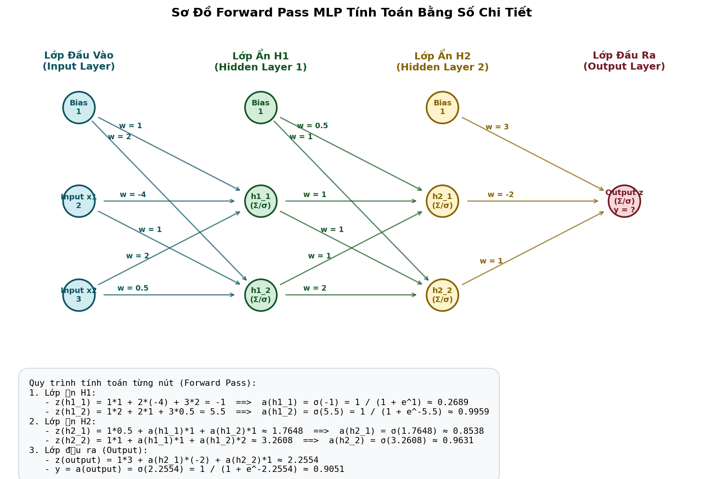

# Thuật toán Lan truyền ngược (Backpropagation) trong mạng MLP (MultiLayer Perceptron)

## 1. Giới thiệu tổng quan về mạng MLP
Mạng MLP (MultiLayer Perceptron) hay còn gọi là mạng Nơ-ron truyền thẳng nhiều lớp (Feedforward Neural Network). MLP bao gồm ít nhất ba nhóm lớp:
- **Lớp đầu vào (Input Layer)**: Tiếp nhận dữ liệu đầu vào. Không thực hiện tính toán.
- **Các lớp ẩn (Hidden Layers)**: Thực hiện tính toán tuyến tính và phi tuyến. Có thể có một hoặc nhiều lớp ẩn.
- **Lớp đầu ra (Output Layer)**: Tạo ra dự đoán cuối cùng của mô hình.

```
       [Input Layer]          [Hidden Layer]          [Output Layer]
         (Node x1) ----------> (Node h1) ---------\
                   X         X                    ---------> (Node y_hat)
         (Node x2) ----------> (Node h2) ---------/
```

Trong mạng MLP, các lớp kề nhau được liên kết đầy đủ (Fully Connected). Mỗi kết nối giữa các nơ-ron có một **trọng số (Weight - $W$)** thể hiện mức độ quan trọng của kết nối đó, và mỗi nơ-ron nhận một giá trị **chệch (Bias - $b$)** cho phép dịch chuyển ngưỡng kích hoạt.

---

## 2. Lan truyền tiến (Forward Propagation)
Mục tiêu của lan truyền tiến là tính toán giá trị đầu ra dự đoán từ các giá trị đầu vào thông qua các tầng lớp ẩn.

Giả sử mạng có $L$ lớp. Ký hiệu lớp đầu vào là lớp $0$. Với mỗi lớp $l \in \{1, 2, \dots, L\}$:
1. **Bước tuyến tính**: Tính tổng có trọng số (Pre-activation) $z^{[l]}$ từ kết quả của lớp trước $a^{[l-1]}$:
   $$z^{[l]} = W^{[l]} a^{[l-1]} + b^{[l]}$$
   Trong đó:
   - $W^{[l]}$ là ma trận trọng số kích thước $(n_l \times n_{l-1})$, với $n_l$ là số nơ-ron của lớp $l$.
   - $b^{[l]}$ là vector bias kích thước $(n_l \times 1)$.
   - $a^{[l-1]}$ là vector kích hoạt đầu ra từ lớp trước đó. Với lớp đầu vào, $a^{[0]} = x$.

2. **Bước kích hoạt phi tuyến**: Áp dụng hàm kích hoạt (Activation Function) $g^{[l]}$ để tạo tính phi tuyến cho mô hình:
   $$a^{[l]} = g^{[l]}(z^{[l]})$$
   Các hàm kích hoạt phổ biến bao gồm **Sigmoid**, **ReLU**, **Tanh**, và **Softmax** (ở lớp đầu ra).

Đầu ra của lớp cuối cùng chính là dự đoán của mô hình: $\hat{y} = a^{[L]}$.

---

## 3. Lan truyền ngược (Backpropagation)
Lan truyền ngược là thuật toán sử dụng **quy tắc chuỗi (Chain Rule)** trong giải tích để tính đạo hàm riêng của hàm mất mát (Loss Function) $L$ theo từng trọng số $W^{[l]}$ và bias $b^{[l]}$ trong mạng. Các đạo hàm này (gradients) sau đó được dùng để cập nhật tham số nhằm giảm thiểu sai số của mô hình.

### 3.1. Thiết lập bài toán
Giả sử ta sử dụng hàm mất mát **Mean Squared Error (MSE)** cho một mẫu dữ liệu:
$$L = \frac{1}{2} \| y - a^{[L]} \|^2_2 = \frac{1}{2} \sum_{i=1}^{n_L} (y_i - a_i^{[L]})^2$$
(Hệ số $\frac{1}{2}$ được thêm vào để đơn giản hóa đạo hàm).

Để thực hiện cập nhật tham số theo Gradient Descent:
$$W^{[l]} \leftarrow W^{[l]} - \eta \frac{\partial L}{\partial W^{[l]}}$$
$$b^{[l]} \leftarrow b^{[l]} - \eta \frac{\partial L}{\partial b^{[l]}}$$
với $\eta$ là tốc độ học (learning rate).

### 3.2. Công thức toán chi tiết bằng Chain Rule
Ta định nghĩa sai số (Error term) của lớp $l$ tại node thứ $i$ là:
$$\delta_i^{[l]} = \frac{\partial L}{\partial z_i^{[l]}}$$

#### Bước 1: Tính sai số tại lớp đầu ra $L$ ($\delta^{[L]}$)
Sử dụng quy tắc chuỗi:
$$\delta_i^{[L]} = \frac{\partial L}{\partial z_i^{[L]}} = \frac{\partial L}{\partial a_i^{[L]}} \cdot \frac{\partial a_i^{[L]}}{\partial z_i^{[L]}}$$

- Đạo hàm hàm lỗi theo output $a^{[L]}$:
  $$\frac{\partial L}{\partial a_i^{[L]}} = a_i^{[L]} - y_i$$
- Đạo hàm hàm kích hoạt:
  $$\frac{\partial a_i^{[L]}}{\partial z_i^{[L]}} = g^{[L]\prime}(z_i^{[L]})$$

Do đó:
$$\delta_i^{[L]} = (a_i^{[L]} - y_i) \cdot g^{[L]\prime}(z_i^{[L]})$$
Viết dưới dạng vector (sử dụng phép nhân Hadamard $\odot$ - nhân từng phần tử tương ứng):
$$\delta^{[L]} = (a^{[L]} - y) \odot g^{[L]\prime}(z^{[L]})$$

#### Bước 2: Lan truyền sai số ngược về các lớp ẩn $l = L-1, L-2, \dots, 1$ ($\delta^{[l]}$)
Ta muốn tính $\delta^{[l]}$ dựa trên sai số của lớp kế tiếp $\delta^{[l+1]}$:
$$\delta_j^{[l]} = \frac{\partial L}{\partial z_j^{[l]}} = \sum_{k} \frac{\partial L}{\partial z_k^{[l+1]}} \cdot \frac{\partial z_k^{[l+1]}}{\partial z_j^{[l]}} = \sum_{k} \delta_k^{[l+1]} \cdot \frac{\partial z_k^{[l+1]}}{\partial z_j^{[l]}}$$

Ta có:
$$z_k^{[l+1]} = \sum_{m} W_{km}^{[l+1]} a_m^{[l]} + b_k^{[l+1]} \implies \frac{\partial z_k^{[l+1]}}{\partial a_j^{[l]}} = W_{kj}^{[l+1]}$$
Đồng thời:
$$a_j^{[l]} = g^{[l]}(z_j^{[l]}) \implies \frac{\partial a_j^{[l]}}{\partial z_j^{[l]}} = g^{[l]\prime}(z_j^{[l]})$$

Áp dụng quy tắc chuỗi:
$$\frac{\partial z_k^{[l+1]}}{\partial z_j^{[l]}} = \frac{\partial z_k^{[l+1]}}{\partial a_j^{[l]}} \cdot \frac{\partial a_j^{[l]}}{\partial z_j^{[l]}} = W_{kj}^{[l+1]} \cdot g^{[l]\prime}(z_j^{[l]})$$

Thay thế lại phương trình sai số $\delta_j^{[l]}$:
$$\delta_j^{[l]} = \sum_{k} \delta_k^{[l+1]} W_{kj}^{[l+1]} g^{[l]\prime}(z_j^{[l]}) = \left( \sum_{k} W_{kj}^{[l+1]} \delta_k^{[l+1]} \right) \cdot g^{[l]\prime}(z_j^{[l]})$$

Viết dưới dạng vector ma trận:
$$\delta^{[l]} = \left( (W^{[l+1]})^T \delta^{[l+1]} \right) \odot g^{[l]\prime}(z^{[l]})$$

#### Bước 3: Tính toán Gradient của Weights và Biases ở mỗi lớp $l$
Có được sai số $\delta^{[l]}$, ta dễ dàng tính đạo hàm riêng của $L$ theo $W^{[l]}$ và $b^{[l]}$:
- **Đối với Weight $W_{ij}^{[l]}$**:
  $$\frac{\partial L}{\partial W_{ij}^{[l]}} = \frac{\partial L}{\partial z_i^{[l]}} \cdot \frac{\partial z_i^{[l]}}{\partial W_{ij}^{[l]}} = \delta_i^{[l]} \cdot a_j^{[l-1]}$$
  Dưới dạng vector:
  $$\frac{\partial L}{\partial W^{[l]}} = \delta^{[l]} (a^{[l-1]})^T$$

- **Đối với Bias $b_i^{[l]}$**:
  $$\frac{\partial L}{\partial b_i^{[l]}} = \frac{\partial L}{\partial z_i^{[l]}} \cdot \frac{\partial z_i^{[l]}}{\partial b_i^{[l]}} = \delta_i^{[l]} \cdot 1 = \delta_i^{[l]}$$
  Dưới dạng vector:
  $$\frac{\partial L}{\partial b^{[l]}} = \delta^{[l]}$$

---

## 4. Ví dụ tính toán bằng số chi tiết (Numerical Example)
Để làm rõ lý thuyết trên, chúng ta thực hiện tính toán thủ công trên mạng MLP có cấu trúc 3 lớp (Input -> Hidden 1 -> Hidden 2 -> Output) từ hình vẽ tay của bạn:
- **Dữ liệu đầu vào (Input)**: $x_1 = 2, x_2 = 3$, và bias $b = 1$.
- **Hàm kích hoạt**: Sigmoid $\sigma(z) = \frac{1}{1 + e^{-z}}$ ở tất cả các lớp.
- **Giá trị nhãn mục tiêu giả định (Target)**: $y = 0.5$ (Để tính toán bước Backpropagation).



---

### 4.1. Khởi tạo tham số mạng (Weights & Biases)

#### Lớp ẩn 1 (Hidden Layer 1 - $H_1$):
* Neuron $h_{1,1}$: Nhận các liên kết từ bias (trọng số $1$), $x_1$ (trọng số $-4$), $x_2$ (trọng số $2$).
* Neuron $h_{1,2}$: Nhận các liên kết từ bias (trọng số $2$), $x_1$ (trọng số $1$), $x_2$ (trọng số $0.5$).
Ma trận trọng số $W^{[1]}$ và bias $b^{[1]}$:
$$W^{[1]} = \begin{bmatrix} -4 & 2 \\ 1 & 0.5 \end{bmatrix}, \quad b^{[1]} = \begin{bmatrix} 1 \\ 2 \end{bmatrix}$$

#### Lớp ẩn 2 (Hidden Layer 2 - $H_2$):
* Neuron $h_{2,1}$: Nhận các liên kết từ bias lớp trước (trọng số $0.5$), $h_{1,1}$ (trọng số $1$), $h_{1,2}$ (trọng số $1$).
* Neuron $h_{2,2}$: Nhận các liên kết từ bias lớp trước (trọng số $1$), $h_{1,1}$ (trọng số $1$), $h_{1,2}$ (trọng số $2$).
Ma trận trọng số $W^{[2]}$ và bias $b^{[2]}$:
$$W^{[2]} = \begin{bmatrix} 1 & 1 \\ 1 & 2 \end{bmatrix}, \quad b^{[2]} = \begin{bmatrix} 0.5 \\ 1 \end{bmatrix}$$

#### Lớp đầu ra (Output Layer - $O$):
* Neuron đầu ra $z$: Nhận liên kết từ bias (trọng số $3$), $h_{2,1}$ (trọng số $-2$), $h_{2,2}$ (trọng số $1$).
Ma trận trọng số $W^{[3]}$ và bias $b^{[3]}$:
$$W^{[3]} = \begin{bmatrix} -2 & 1 \end{bmatrix}, \quad b^{[3]} = \begin{bmatrix} 3 \end{bmatrix}$$

---

### 4.2. Lan truyền tiến (Forward Pass)

#### Lớp ẩn 1 (Layer 1):
* Tính giá trị tiền kích hoạt $z^{[1]}$:
  $$z_{1,1}^{[1]} = w_{1,1}^{[1]}x_1 + w_{1,2}^{[1]}x_2 + b_1^{[1]} = (-4) \times 2 + 2 \times 3 + 1 = -8 + 6 + 1 = -1$$
  $$z_{1,2}^{[1]} = w_{2,1}^{[1]}x_1 + w_{2,2}^{[1]}x_2 + b_2^{[1]} = 1 \times 2 + 0.5 \times 3 + 2 = 2 + 1.5 + 2 = 5.5$$
* Tính đầu ra kích hoạt $a^{[1]}$:
  $$a_{1,1}^{[1]} = \sigma(-1) = \frac{1}{1 + e^1} \approx 0.268941$$
  $$a_{1,2}^{[1]} = \sigma(5.5) = \frac{1}{1 + e^{-5.5}} \approx 0.995930$$

#### Lớp ẩn 2 (Layer 2):
* Tính giá trị tiền kích hoạt $z^{[2]}$:
  $$z_{2,1}^{[2]} = w_{1,1}^{[2]}a_{1,1}^{[1]} + w_{1,2}^{[2]}a_{1,2}^{[1]} + b_1^{[2]} = 1 \times 0.268941 + 1 \times 0.995930 + 0.5 \approx 1.764871$$
  $$z_{2,2}^{[2]} = w_{2,1}^{[2]}a_{1,1}^{[1]} + w_{2,2}^{[2]}a_{1,2}^{[1]} + b_2^{[2]} = 1 \times 0.268941 + 2 \times 0.995930 + 1 \approx 3.260801$$
* Tính đầu ra kích hoạt $a^{[2]}$:
  $$a_{2,1}^{[2]} = \sigma(1.764871) = \frac{1}{1 + e^{-1.764871}} \approx 0.853818$$
  $$a_{2,2}^{[2]} = \sigma(3.260801) = \frac{1}{1 + e^{-3.260801}} \approx 0.963074$$

#### Lớp đầu ra (Layer 3):
* Tính giá trị tiền kích hoạt $z^{[3]}$:
  $$z_1^{[3]} = w_{1,1}^{[3]}a_{2,1}^{[2]} + w_{1,2}^{[3]}a_{2,2}^{[2]} + b_1^{[3]} = (-2) \times 0.853818 + 1 \times 0.963074 + 3 = -1.707636 + 0.963074 + 3 \approx 2.255438$$
* Tính đầu ra kích hoạt $a^{[3]}$ (Dự đoán cuối cùng $\hat{y}$):
  $$\hat{y} = a_1^{[3]} = \sigma(2.255438) = \frac{1}{1 + e^{-2.255438}} \approx 0.905085$$

---

### 4.3. Lan truyền ngược (Backward Pass)
Giả định nhãn thực tế $y = 0.5$ và hàm Loss là MSE $L = \frac{1}{2}(y - \hat{y})^2$:
* Tính Loss hiện tại:
  $$L = \frac{1}{2}(0.5 - 0.905085)^2 \approx 0.082047$$

#### Lớp đầu ra (Layer 3):
* Tính sai số $\delta_1^{[3]}$:
  $$\delta_1^{[3]} = (\hat{y} - y) \cdot \hat{y}(1 - \hat{y}) = (0.905085 - 0.5) \cdot 0.905085 \cdot (1 - 0.905085) \approx 0.034800$$
* Tính gradients của tham số lớp 3:
  $$\frac{\partial L}{\partial w_{1,1}^{[3]}} = \delta_1^{[3]} \cdot a_{2,1}^{[2]} = 0.034800 \times 0.853818 \approx 0.029713$$
  $$\frac{\partial L}{\partial w_{1,2}^{[3]}} = \delta_1^{[3]} \cdot a_{2,2}^{[2]} = 0.034800 \times 0.963074 \approx 0.033515$$
  $$\frac{\partial L}{\partial b_1^{[3]}} = \delta_1^{[3]} \approx 0.034800$$

#### Lớp ẩn 2 (Layer 2):
* Lan truyền ngược sai số về lớp 2:
  $$\delta_1^{[2]} = \left( \delta_1^{[3]} \cdot w_{1,1}^{[3]} \right) \cdot a_{2,1}^{[2]}(1 - a_{2,1}^{[2]}) = (0.034800 \times (-2)) \cdot 0.853818 \cdot (1 - 0.853818) \approx -0.008688$$
  $$\delta_2^{[2]} = \left( \delta_1^{[3]} \cdot w_{1,2}^{[3]} \right) \cdot a_{2,2}^{[2]}(1 - a_{2,2}^{[2]}) = (0.034800 \times 1) \cdot 0.963074 \cdot (1 - 0.963074) \approx 0.001237$$
* Tính gradients của tham số lớp 2:
  $$\frac{\partial L}{\partial W^{[2]}} = \delta^{[2]} (a^{[1]})^T \implies \frac{\partial L}{\partial w_{1,1}^{[2]}} = \delta_1^{[2]} \cdot a_{1,1}^{[1]} \approx -0.002337, \quad \frac{\partial L}{\partial w_{1,2}^{[2]}} = \delta_1^{[2]} \cdot a_{1,2}^{[1]} \approx -0.008653$$
  $$\frac{\partial L}{\partial w_{2,1}^{[2]}} = \delta_2^{[2]} \cdot a_{1,1}^{[1]} \approx 0.000333, \quad \frac{\partial L}{\partial w_{2,2}^{[2]}} = \delta_2^{[2]} \cdot a_{1,2}^{[1]} \approx 0.001232$$
  $$\frac{\partial L}{\partial b_1^{[2]}} = \delta_1^{[2]} \approx -0.008688, \quad \frac{\partial L}{\partial b_2^{[2]}} = \delta_2^{[2]} \approx 0.001237$$

#### Lớp ẩn 1 (Layer 1):
* Lan truyền ngược sai số về lớp 1:
  $$\delta_1^{[1]} = \left( \delta_1^{[2]} w_{1,1}^{[2]} + \delta_2^{[2]} w_{2,1}^{[2]} \right) \cdot a_{1,1}^{[1]}(1 - a_{1,1}^{[1]}) = (-0.008688 \times 1 + 0.001237 \times 1) \cdot 0.268941 \cdot (1 - 0.268941) \approx -0.001465$$
  $$\delta_2^{[1]} = \left( \delta_1^{[2]} w_{1,2}^{[2]} + \delta_2^{[2]} w_{2,2}^{[2]} \right) \cdot a_{1,2}^{[1]}(1 - a_{1,2}^{[1]}) = (-0.008688 \times 1 + 0.001237 \times 2) \cdot 0.995930 \cdot (1 - 0.995930) \approx -0.000025$$
* Tính gradients của tham số lớp 1:
  $$\frac{\partial L}{\partial w_{1,1}^{[1]}} = \delta_1^{[1]} \cdot x_1 \approx -0.002930, \quad \frac{\partial L}{\partial w_{1,2}^{[1]}} = \delta_1^{[1]} \cdot x_2 \approx -0.004395, \quad \frac{\partial L}{\partial b_1^{[1]}} = \delta_1^{[1]} \approx -0.001465$$
  $$\frac{\partial L}{\partial w_{2,1}^{[1]}} = \delta_2^{[1]} \cdot x_1 \approx -0.000050, \quad \frac{\partial L}{\partial w_{2,2}^{[1]}} = \delta_2^{[1]} \cdot x_2 \approx -0.000075, \quad \frac{\partial L}{\partial b_2^{[1]}} = \delta_2^{[1]} \approx -0.000025$$

---

### 4.4. Cập nhật trọng số (Ví dụ với tốc độ học $\eta = 0.5$)
Áp dụng công thức cập nhật $W_{new} = W_{old} - \eta \cdot \text{gradient}$:
* **Lớp đầu ra (Layer 3)**:
  $$w_{1,1}^{[3](new)} = -2 - 0.5 \times 0.029713 = -2.014857$$
  $$w_{1,2}^{[3](new)} = 1 - 0.5 \times 0.033515 = 0.983243$$
  $$b_1^{[3](new)} = 3 - 0.5 \times 0.034800 = 2.982600$$

* **Lớp ẩn 2 (Layer 2)**:
  $$w_{1,1}^{[2](new)} = 1 - 0.5 \times (-0.002337) = 1.001169$$
  $$w_{1,2}^{[2](new)} = 1 - 0.5 \times (-0.008653) = 1.004327$$
  $$b_1^{[2](new)} = 0.5 - 0.5 \times (-0.008688) = 0.504344$$
  $$w_{2,1}^{[2](new)} = 1 - 0.5 \times 0.000333 = 0.999834$$
  $$w_{2,2}^{[2](new)} = 2 - 0.5 \times 0.001232 = 1.999384$$
  $$b_2^{[2](new)} = 1 - 0.5 \times 0.001237 = 0.999382$$

* **Lớp ẩn 1 (Layer 1)**:
  $$w_{1,1}^{[1](new)} = -4 - 0.5 \times (-0.002930) = -3.998535$$
  $$w_{1,2}^{[1](new)} = 2 - 0.5 \times (-0.004395) = 2.002198$$
  $$b_1^{[1](new)} = 1 - 0.5 \times (-0.001465) = 1.000733$$
  $$w_{2,1}^{[1](new)} = 1 - 0.5 \times (-0.000050) = 1.000025$$
  $$w_{2,2}^{[1](new)} = 0.5 - 0.5 \times (-0.000075) = 0.500038$$
  $$b_2^{[1](new)} = 2 - 0.5 \times (-0.000025) = 2.000013$$

Sau 1 bước cập nhật, nếu thực hiện lan truyền tiến lại với các trọng số mới, giá trị dự đoán $\hat{y}$ sẽ tiến gần hơn về target $y = 0.5$, và Loss sẽ giảm xuống.

---

## 5. Hiện thực thuật toán trên Python
Để xem mã nguồn chi tiết cài đặt MLP tự phát triển từ đầu bằng thư viện NumPy, xem file mã nguồn đi kèm tại:
👉 [mlp_backpropagation.py](file:///e:/DoCode/Master_Subject2026_TDTU/DeepLearning/gradient_descent/mlp_backpropagation.py)
