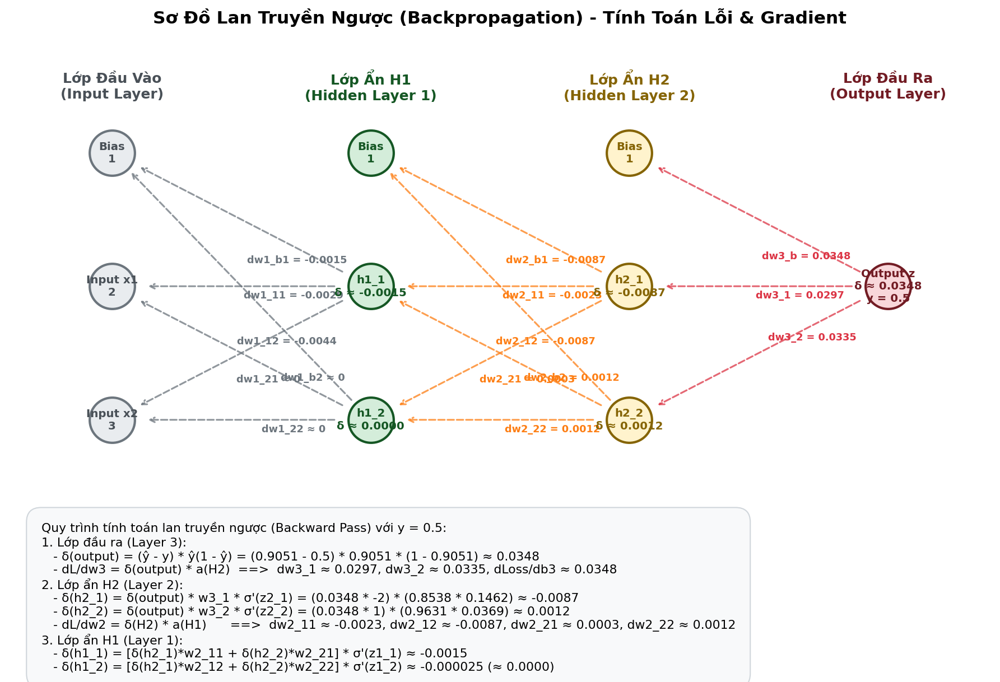

# Giải thích Sơ đồ Lan truyền ngược (Backpropagation Diagram)

Sơ đồ dưới đây trực quan hóa cách sai số lan truyền ngược qua các tầng của mạng Multi-Layer Perceptron (MLP) để cập nhật các tham số Weights và Biases.

---

## 1. Các thành phần chính trong sơ đồ
* **Input Layer (Lớp đầu vào)**: Nhận dữ liệu đầu vào ($x_1 = 2$, $x_2 = 3$).
* **Hidden Layers (H1 & H2 - Lớp ẩn 1 & 2)**: Các tầng trung gian thực hiện các biến đổi phi tuyến bằng hàm kích hoạt Sigmoid ($\sigma$).
* **Output Layer (Lớp đầu ra)**: Tạo ra dự đoán cuối cùng $\hat{y}$ (y_hat).
* **Target y**: Giá trị thực tế (nhãn thực) dùng để so sánh với dự đoán $\hat{y}$.

---

## 2. Ý nghĩa của các luồng mũi tên
Sơ đồ thể hiện sự kết hợp của hai quá trình diễn ra liên tục trong quá trình huấn luyện:

### A. Luồng truyền tiến - Forward Pass (Mũi tên màu xanh dương nét liền)
* **Hướng đi**: Từ trái sang phải (Input $\rightarrow$ H1 $\rightarrow$ H2 $\rightarrow$ Output).
* **Nhiệm vụ**: Tính toán giá trị kích hoạt của từng nơ-ron qua các tầng để đưa ra dự đoán cuối cùng $\hat{y}$. Ở mỗi nút ẩn và đầu ra, ta tính tổng tuyến tính $z = W a_{prev} + b$, sau đó áp dụng hàm kích hoạt phi tuyến $a = \sigma(z)$.

### B. Luồng truyền ngược - Backward Pass (Mũi tên màu đỏ nét đứt)
* **Hướng đi**: Từ phải sang trái (Loss compute $\rightarrow$ Output $\rightarrow$ H2 $\rightarrow$ H1 $\rightarrow$ Input).
* **Nhiệm vụ**: Lan truyền sai số ngược lại mạng để tính toán các đạo hàm riêng (gradients) của hàm Loss đối với từng trọng số và bias.

---

## 3. Ý nghĩa của các thuật ngữ toán học trên sơ đồ

### 1. Loss compute (Tính toán hàm mất mát)
Ở lớp đầu ra, mô hình so sánh dự đoán $\hat{y}$ với nhãn thực tế $Target\ y$ để xác định sai số tổng thể thông qua hàm Loss $L(y, \hat{y})$ (ví dụ như Mean Squared Error):
$$L = \frac{1}{2}(y - \hat{y})^2$$

### 2. delta (error) - Ký hiệu $\delta$
* **Định nghĩa**: Sai số $\delta$ tại một nơ-ron thể hiện mức độ đóng góp của nơ-ron đó vào lỗi tổng thể của mô hình.
* **Công thức toán**: 
  $$\delta^{[l]} = \frac{\partial L}{\partial z^{[l]}}$$
* **Luồng lan truyền**:
  - Tại lớp Output: Sai số được tính trực tiếp từ độ lệch giữa dự đoán và nhãn thực:
    $$\delta^{[L]} = (\hat{y} - y) \cdot \sigma'(z^{[L]})$$
  - Tại các lớp ẩn (H2, H1): Sai số của lớp hiện tại được tính bằng cách nhân ma trận trọng số liên kết với sai số của lớp liền sau:
    $$\delta^{[l]} = \left( (W^{[l+1]})^T \delta^{[l+1]} \right) \odot \sigma'(z^{[l]})$$
    *(Điều này giải thích tại sao các mũi tên đứt màu đỏ hướng ngược từ lớp sau về lớp trước)*.

### 3. dLoss/db & dLoss/dW (Gradients)
Đây là mục tiêu cốt lõi của Backpropagation. Để tối ưu hóa mạng nơ-ron bằng thuật toán Gradient Descent, ta cần biết các giá trị đạo hàm riêng này:
* **dLoss/db ($\frac{\partial L}{\partial b}$)**: Đạo hàm của Loss theo bias $b$. Nó chính bằng giá trị sai số $\delta$ tại nơ-ron đó:
  $$\frac{\partial L}{\partial b^{[l]}} = \delta^{[l]}$$
* **dLoss/dW ($\frac{\partial L}{\partial W}$)**: Đạo hàm của Loss theo trọng số $W$. Nó là tích của sai số lớp hiện tại $\delta^{[l]}$ và đầu ra kích hoạt của lớp trước đó $a^{[l-1]}$:
  $$\frac{\partial L}{\partial W^{[l]}} = \delta^{[l]} (a^{[l-1]})^T$$

Các giá trị gradient này sẽ được dùng để cập nhật trọng số và bias theo công thức:
$$W^{[l]} \leftarrow W^{[l]} - \eta \frac{\partial L}{\partial W^{[l]}}$$
$$b^{[l]} \leftarrow b^{[l]} - \eta \frac{\partial L}{\partial b^{[l]}}$$

---

## 4. Tóm tắt các bước huấn luyện trên sơ đồ
1. **Bước 1**: Đưa $x_1, x_2$ vào mạng, tính toán lần lượt qua H1, H2 để được dự đoán $\hat{y}$ (Mũi tên xanh).
2. **Bước 2**: So sánh $\hat{y}$ với $Target\ y$ để tính giá trị Loss (Hộp Loss compute).
3. **Bước 3**: Tính sai số $\delta^{[3]}$ tại Output Layer.
4. **Bước 4**: Lan truyền ngược $\delta^{[3]}$ về lớp H2 để tính $\delta^{[2]}$, từ đó tính toán được các gradient $\frac{\partial L}{\partial W^{[3]}}$ và $\frac{\partial L}{\partial b^{[3]}}$ (Mũi tên đỏ).
5. **Bước 5**: Tiếp tục lan truyền ngược từ H2 về H1 để tính $\delta^{[1]}$, qua đó tính các gradient lớp 2 và lớp 1.
6. **Bước 6**: Thực hiện cập nhật toàn bộ tham số $W$ và $b$ bằng Gradient Descent. Lặp lại chu kỳ này cho đến khi mạng hội tụ.
